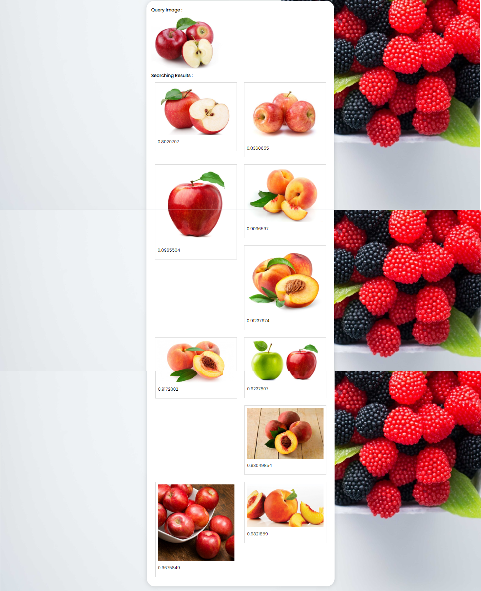

# Fruit-Images-Search-Engine
<b>Content Based Image Retrieval (CBIR)</b> Applications of <b>Information Retrieval</b> with Fruit Images.

<!-- TABLE OF CONTENTS -->
<details open="open">
  <summary>Table of Contents</summary>
  <ol>
    <li><a href="#description">Description</a><li>
      <a href="#getting-started">Getting Started</a>
      <ul>
        <li><a href="#dependencies">Dependencies</a></li>
        <li><a href="#executing-program">Executing program</a></li>
      </ul>
    </li>
    <li><a href="#screenshots">Screenshots</a></li>
    <li><a href="#authors">Authors</a></li>
    <li><a href="#version-history">Version History</a></li>
    <li><a href="#license">License</a></li>
  </ol>
</details>

## Description

This is a web-based search engine program of Information Retrieval or Content Based Image Retrieval (CBIR) application to search the most similar fruit images based on an uploaded image. The result will also shown the euclidean distance between uploaded image and the result image. This program is created with Flask using Python programming language.

## Getting Started

### Dependencies

* Numpy
* Pillow
* Flask
* Tensorflow

### Executing program

1. Intall all requirements needed by runnning this command :
```
pip install -r requirements.txt
```
2. Put all fruit images dataset that you want to add in `static/img` folder
3. Do the feature extraction to the images dataset by executing this command :
```
python offline.py
```
5. Run Flask by executing this command :
```
python server.py
```
3. Open Given URL (Usually `127.0.0.1:5000` or `localhost:5000`)

## Screenshots

### Select the file


### Retrieve images


## Authors

* Linggar Maretva Cendani - [Linggar Maretva Cendani](https://linggar.me) - [linggarmc@gmail.com](mailto:linggarmc@gmail.com)

## Version History

* 0.1
    * Initial Release

## License

This project is licensed under the MIT License - see the [LICENSE](LICENSE) file for details
